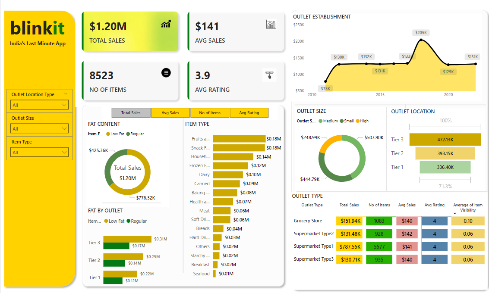

# 📊 Blinkit Sales Dashboard

## Table of Contents
- [Description](#Description)
- [Demonstration](#Demonstration)
- [Technologies Used](#Technologies_Used)
- [Key Features](#Key_Features)
- [Example Usage](#example-usage)
- [Dataset](#Dataset)
- [Insights](#Insights_Drawn_from_Power_BI_Analysis)
- [Conclusion](#Conclusion)
- [Future_Scope](#Future_Scope)
- [Contributing](#Contributing)
- [License](#License)

## 📝 Description

The Blinkit Sales Dashboard is a Power BI visualization designed to provide actionable insights into Blinkit's operational and sales performance. This interactive dashboard enables users to explore data across various dimensions such as sales trends, item categories, outlet sizes, and geographic locations, making it a powerful tool for decision-making and strategy development.

## 🔍 Demonstration

This image showcases the Blinkit dashboard, highlighting key metrics such as total sales, average sales, and the number of items sold. The dashboard features interactive charts and slicers for dynamic data exploration.

## 🛠️ Technologies Used

- **Power BI**: For creating the dashboard and visualizing data.
- **Data Sources**: A CSV file containing Blinkit’s sample sales and operational data.

## 📊 Key Features

1. **Comprehensive Overview**:
   - **Total Sales:** $1.20M
   - **Average Sales per Outlet:** $141
   - **Number of Items Sold:** 8,523
   - **Average Rating:** 3.9

2. **Interactive Visualizations**:
   - **Sales Trends:** Analyze sales growth over time using line graphs.
   - **Item Type Analysis:** Bar charts displaying sales distribution across item categories (e.g., Fruits, Dairy, Frozen Foods).
   - **Outlet Performance:** Pie and donut charts for sales by outlet size and location tiers.

3. **Filter Options**:
   - Slice data by **Outlet Location Type**, **Outlet Size**, and **Item Type** for detailed insights.

4. **Outlet Comparison**:
   - View and compare metrics for various outlet types (e.g., Grocery Store, Supermarket Type 1).

## 📂 Dataset

The dashboard uses a CSV file containing sample data for analysis. 

- **File Name:** `blinkit_sales_data.csv`
- **Download Link:** [blinkit_sales_data.csv](./BlinkIT-Grocery-Data.csv)

The dataset includes the following columns:
- Outlet Type
- Outlet Size
- Item Type
- Item Fat Content
- Sales Figures
- Number of Items Sold
- Outlet Location Tier
- Ratings

## 📈 Insights Drawn from Power BI Analysis

1. **Sales Trends**:
   - Blinkit experienced significant growth in sales after 2015, peaking in 2020 at $205K, which could indicate a rise in demand for instant delivery services.
   
2. **Item Category Preferences**:
   - Fruits and Snacks are the top-performing categories, each contributing $0.18M to total sales.
   - Categories like Breakfast and Seafood show low sales, indicating potential areas for improvement or targeted marketing.

3. **Outlet Performance**:
   - Large outlets generate the highest revenue, with sales amounting to $507.90K. Medium outlets follow at $444.79K.
   - Outlets in Tier 3 locations outperform others, contributing $472.13K to total sales, suggesting a strong demand in less urban areas.

4. **Customer Behavior**:
   - Regular fat content items are more popular, contributing $776.32K, compared to low-fat items at $425.36K.
   - The average rating of 3.9 indicates moderate customer satisfaction, leaving room for improvement in service quality.

5. **Outlet Types**:
   - Supermarket Type 1 has the highest total sales ($787.55K), while Grocery Stores exhibit high customer ratings.

## 🔍 Conclusions

1. **Tier 3 locations dominate sales**, showing strong potential for expansion and increased investment in these areas.
2. **Fruits and Snacks are the leading categories**, and further inventory optimization in these areas could boost revenue.
3. **Large outlets generate higher revenue**, suggesting they should be prioritized for new store openings or enhancements.
4. **Customer satisfaction requires improvement**, as an average rating of 3.9 highlights the need to address service issues or enhance product quality.
5. **Low-performing categories**, such as Breakfast and Seafood, need targeted promotions or reevaluation of inventory strategies to increase sales.

## 🚀 Future Scope

- **Real-Time Data Integration**: Incorporate live data feeds for up-to-date analysis.
- **Enhanced Filters**: Add more granular filtering options (e.g., specific regions or product types).
- **Export Features**: Enable exporting reports and insights in various formats.
- **Mobile-Friendly Design**: Develop a mobile version of the dashboard.

## 🤝 Contributing

Contributions to enhance the dashboard are welcome! Whether it’s adding new visualizations, improving interactivity, or optimizing performance, feel free to fork the repository and submit a pull request.

## 📄 License

This project is licensed under the MIT License. See the [LICENSE](LICENSE) file for details.
